# Gallery

Output from the example scripts that ship in `Epicycle/examples/`.

## A Trajectory on the Globe

A view of Earth and an orbit.

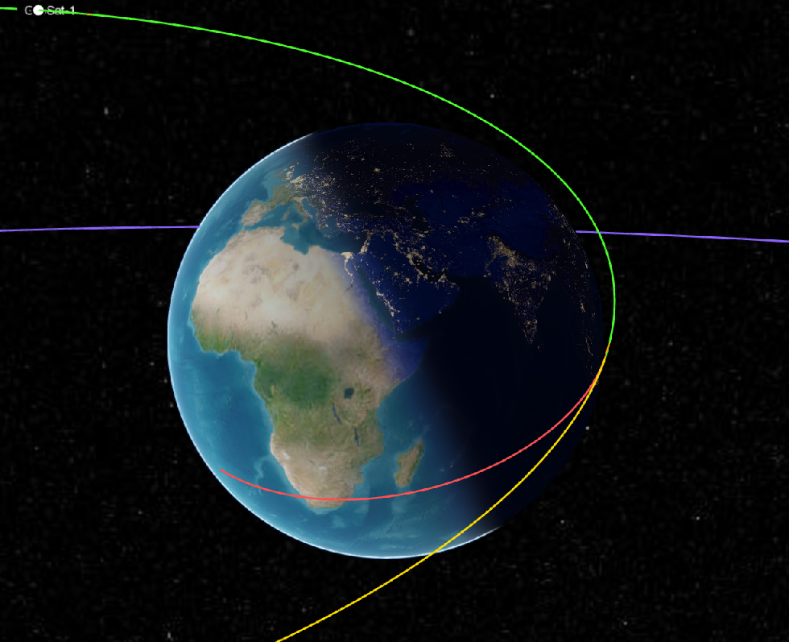

## Working in the Editor

This is `Ex_HohmannTransfer.jl` open in VS Code with the solver report in the terminal.

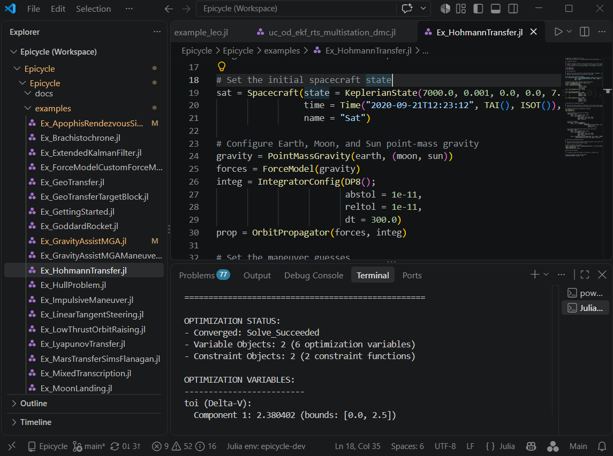

## Propagation and Targeting

A Hohmann transfer between two circular orbits.

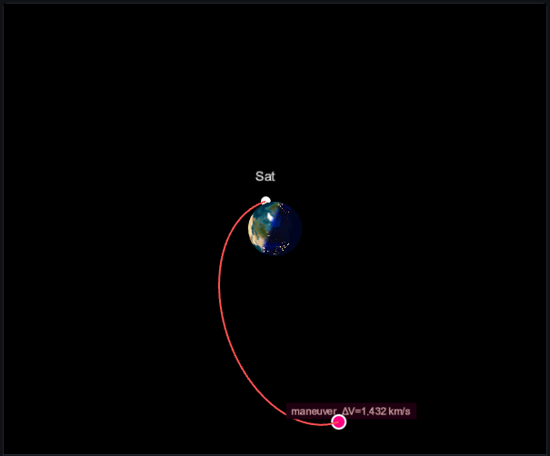

A geosynchronous orbit transfer.

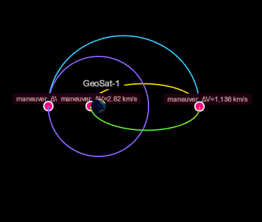

A close-proximity transfer onto a safety ellipse, in the chief's rotating frame. The arrows are
the thrust direction.

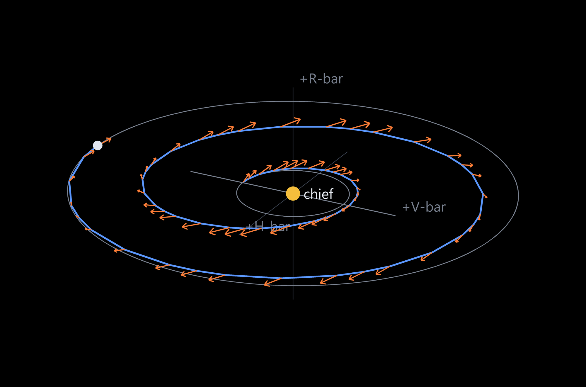

## Optimal Control

Low-thrust orbit raising.

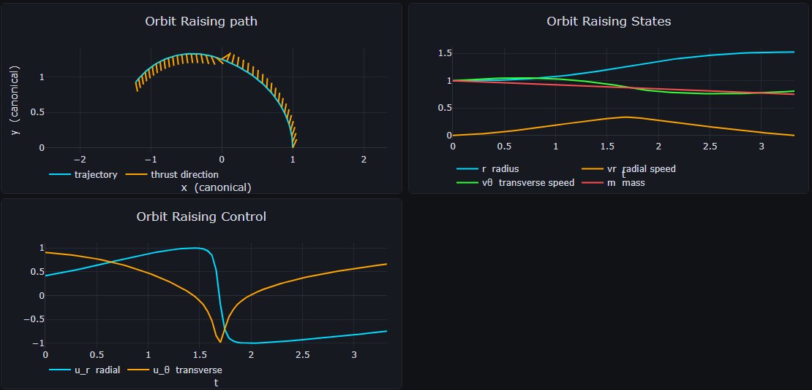

Low-thrust orbit raising with three phases, each with a different transcription — zero-order hold, Hermite-Simpson and
Legendre-Gauss-Lobatto.

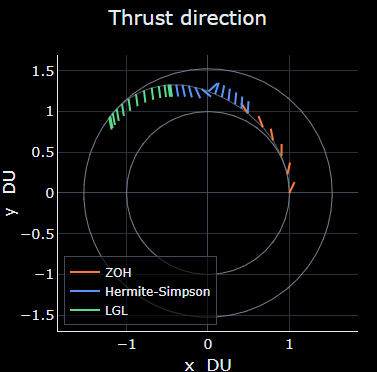

The Goddard rocket problem.

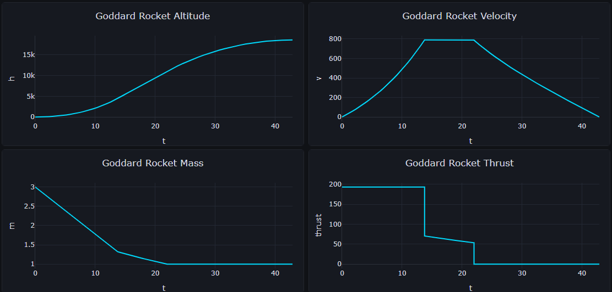

The linear tangent steering problem.

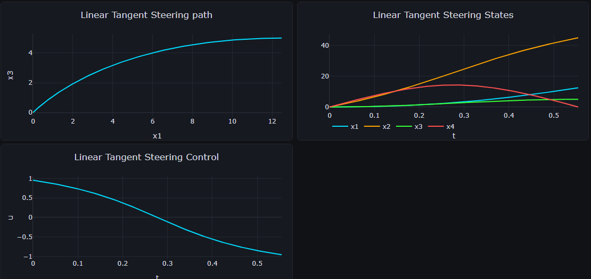

A minimum-time route between two keep-out zones, where the clearance is a path constraint.

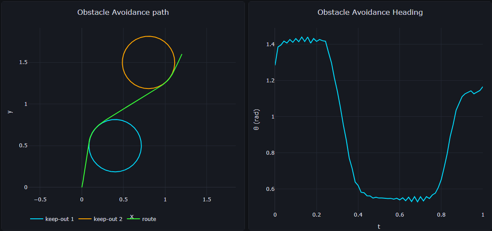

A transfer between L1 and L2 Lyapunov orbits.

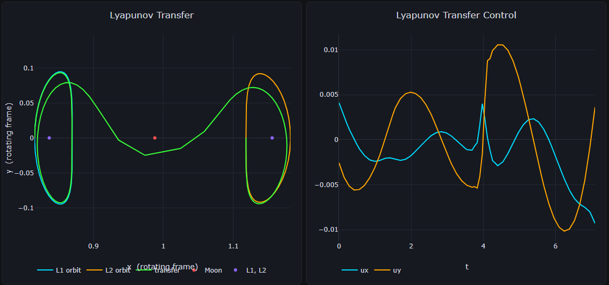

## Interplanetary

An Earth to Apophis rendezvous with Sims-Flanagan transcription.

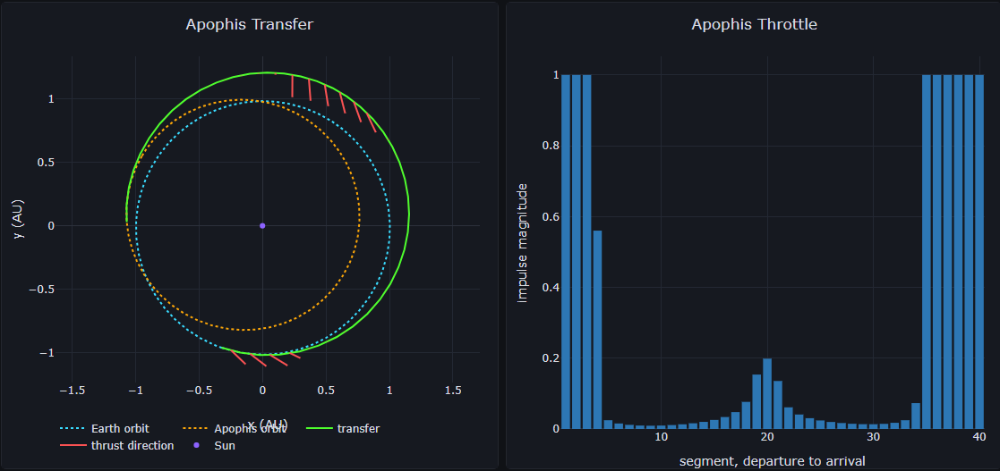

An Earth-Earth-Venus gravity assist.

## Orbit Determination

A batch least-squares fit to six hours of range and Doppler tracking from two ground stations.

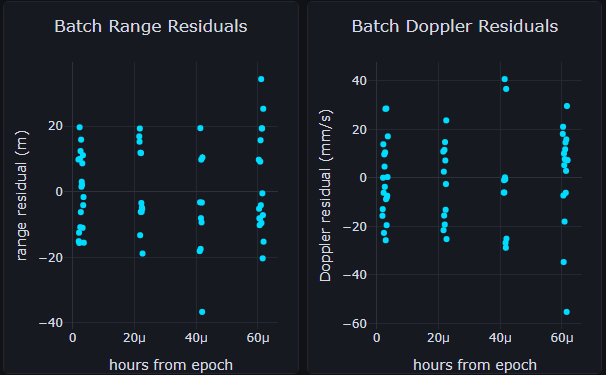

A filter set up to process measurements as they arrive.

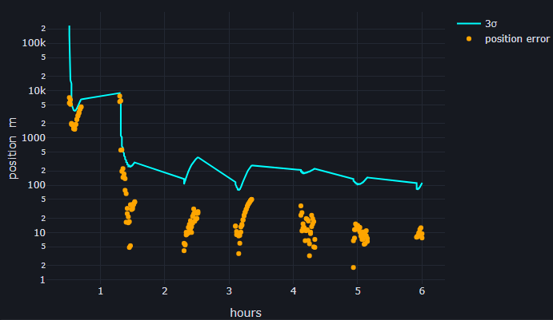

A filter-smoother solution.

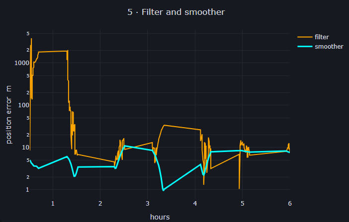

Stepping the filter one observation at a time, with the postfit residuals and the formal sigma
recorded at each update.

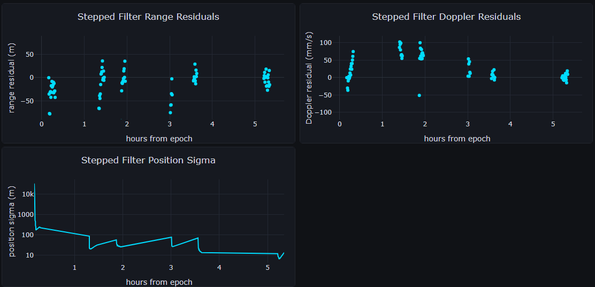

## Plotting

A gallery of supported data visualization styles.

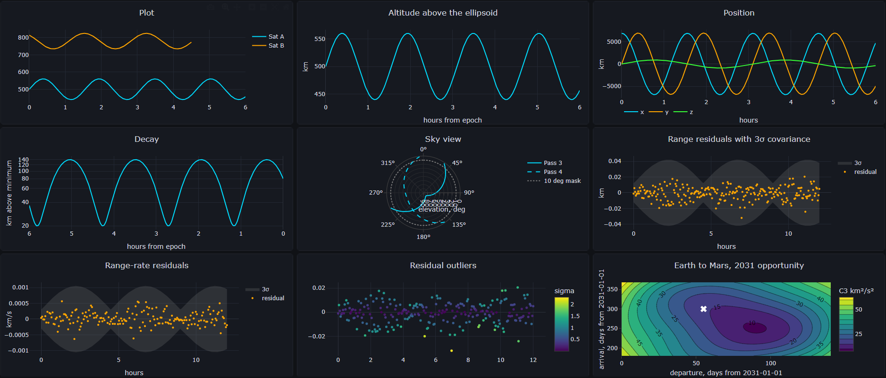
