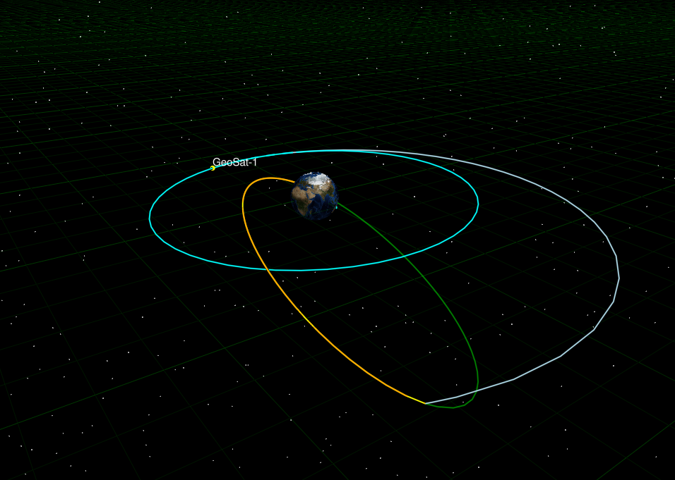

# Graphics and Visualization

## Overview

Epicycle provides 3D visualization capabilities through its graphics module. The graphics system is built on GLMakie for GPU-accelerated rendering and includes:

- **Trajectory rendering** - Automatic rendering from spacecraft history segments
- **CAD model loading** - Display spacecraft using custom 3D models (.obj files)
- **Celestial body rendering** - Render Earth, Moon, and other bodies with texture mapping
- **Iteration history visualization** - View optimization solver progress across iterations
- **Multiple spacecraft support** - Visualize constellations and multi-spacecraft scenarios



*Example: GEO transfer trajectory with plane change correction, showing 8-event optimization sequence.*

## Installation & Requirements

The graphics module requires additional dependencies beyond the core Epicycle package:

```julia
using Pkg
Pkg.add(["GLMakie", "FileIO", "MeshIO"])
```

## Quick Start

The basic workflow consists of three steps: create a view, add spacecraft, and display:

```julia
using Epicycle

# Spacecraft
sat = Spacecraft(
    state=KeplerianState(8000.0,0.15,pi/4,pi/2,0.0,pi/2),
    time=Time("2015-09-21T12:23:12", TAI(), ISOT()),
    coord_sys=CoordinateSystem(earth, ICRFAxes()),
    name = "sat",
)

# Forces + integrator
gravity = PointMassGravity(earth,(moon,sun))
forces  = ForceModel(gravity)
integ   = IntegratorConfig(Tsit5(); dt=10.0, reltol=1e-9, abstol=1e-9)
prop    = OrbitPropagator(forces, integ)

# Propagate to periapsis
propagate!(prop, sat, StopAt(sat, PropDurationSeconds(), 5000.0))
println(get_state(sat, Keplerian()))

view = View3D()
add_spacecraft!(view,sat)
display_view(view , size=(1200, 800))
```

This creates an interactive 3D view with the spacecraft trajectory rendered over Earth.

## Examples

### Hohmann Transfer with Solver Iterations

Visualize optimization progress during trajectory design:

```julia
using Epicycle

# [Setup spacecraft, propagator, events as in Ex_HohmannTransfer.jl]
# ...

# Solve with iteration recording enabled
result = solve_trajectory!(seq; record_iterations=true)

# Visualize final solution plus all solver iterations
view = View3D()
add_spacecraft!(view, sat; show_iterations=true)
display_view(view)
```

The `show_iterations=true` flag renders semi-transparent trajectory segments for each solver iteration, showing how the optimizer converged to the final solution.

### Multiple Spacecraft Visualization

Visualize constellations or multi-spacecraft missions:

```julia
using Epicycle

# Create three spacecraft in different orbital planes
sat1 = Spacecraft(
    state = KeplerianState(7000.0, 0.0, deg2rad(0.0), 0.0, 0.0, 0.0),
    name = "Equatorial"
)

sat2 = Spacecraft(
    state = KeplerianState(7000.0, 0.0, deg2rad(45.0), 0.0, 0.0, 0.0),
    name = "Inclined-45"
)

sat3 = Spacecraft(
    state = KeplerianState(7000.0, 0.0, deg2rad(90.0), 0.0, 0.0, 0.0),
    name = "Polar"
)

# Propagate all spacecraft
for sat in [sat1, sat2, sat3]
    propagate!(prop, sat, StopAt(sat, PropDurationDays(), 1.0))
end

# Visualize all three
view = View3D()
add_spacecraft!(view, sat1)
add_spacecraft!(view, sat2)
add_spacecraft!(view, sat3)
display_view(view)
```

### Using Custom CAD Models

Display spacecraft with custom 3D models:

```julia
using Epicycle

# Create spacecraft with CAD model
sat = Spacecraft(
    state = CartesianState([3737.792, -4607.692, -2845.644, 5.411, 5.367, -1.566]),
    name = "Deep Space 1", 
    cad_model = CADModel(
        file_path = joinpath(pkgdir(Epicycle), "assets", "DeepSpace1.obj"),
        scale = 100.0,
        visible = true
    )
)

# Propagate and visualize
propagate!(prop, sat, StopAt(sat, PropDurationDays(), 1.0))

view = View3D()
add_spacecraft!(view, sat)
display_view(view)
```

The spacecraft CAD model will be rendered at each point along the trajectory. If the model file cannot be loaded, a fallback sphere is rendered instead.

## Coordinate Systems

!!! warning "Coordinate System Matching Required"
    The spacecraft's coordinate system must match the view's coordinate system. Coordinate transformations are not currently supported in the graphics module. If spacecraft and view coordinate systems do not match, a validation error will be raised when calling `add_spacecraft!`.

## Limitations and Planned Enhancements

The current release provides core visualization capabilities with smart defaults. Planned enhancements for future releases include:

1. **Animation Support** - Time-dynamic playback with play/pause controls, variable speed, and time scrubbing
2. **Trajectory Customization** - Per-segment colors, line widths, and transparency for multi-phase missions
3. **Multiple Celestial Bodies** - Show multiple celestial bodies in a single view
4. **Overlay Elements** - Velocity vectors, coordinate axes, reference planes (equatorial, ecliptic, orbital), and sensor field-of-view cones
5. **Coordinate Transformations** - Automatic conversion between reference frames (ICRF, ITRF, EME2000, etc.)

**Current Limitations:**
- GPU required (no software rendering fallback)
- Central-body only celestial body rendering
- No time-dynamic visualization (all trajectories shown simultaneously)
- CAD models must be in .obj format
- Coordinate systems must match between view and spacecraft

## API Reference

```@docs
View3D
add_spacecraft!
display_view
```
