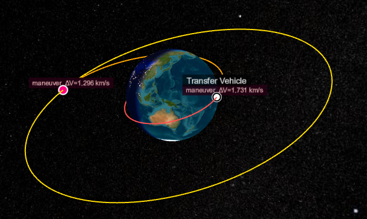

# Epicycle: A Framework for Space Mission Design and Navigation

Epicycle is a Julia package framework for astrodynamics, space mission design, and navigation, built with a modular architecture that spans workflows from preliminary mission design through trajectory optimization and orbit determination. It contains coordinate systems, time standards, spacecraft state and ground station models, propagators, targeters, optimal control transcriptions, and batch and sequential estimators.

The ecosystem consists of twelve specialized packages organized in architectural layers, from core abstractions (EpicycleBase) through astronomical models (AstroEpochs, AstroStates, AstroFrames, AstroRoutines, and AstroUniverse) to integrated workflows (AstroManeuvers, AstroProp, AstroCallbacks, EpicycleIO, and AstroSolve). The structure lets users work with low-level utilities independently of the full system, or compose mission-specific analyses using interfaces designed to solve complex problems, fast. 

```@raw html
<div style="text-align: center;">
  
  <p><em>Example: GEO transfer trajectory with plane change correction, showing 8-event optimization sequence.</em></p>
</div>
```

## Installation

To install the latest version of Epicycle, first add the local registry (the app store, for those unfamiliar with Julia), then install as usual:

```julia
using Pkg
Pkg.Registry.add(
    RegistrySpec(url = "https://github.com/GenAstro/GenAstro.git")
)
Pkg.add("Epicycle")
```

!!! note
    Some packages originally registered in the Julia General registry, including AstroModels, AstroProp, and AstroSolve, have moved to the GenAstro local registry. If you do not add the local registry as shown above, you will install only the first MVP release of Epicycle.

## Example Problems

Epicycle provides a library runnable examples covering propagation, targeting, optimal control and orbit
determination.  The code below shows how to run the "getting started" example, and how to get the names of
all examples to run others in the suite.

```julia
# Run the example named "Ex_GettingStarted"
using Epicycle
Epicycle.run_example("Ex_GettingStarted")

# Print the names of all examples
Epicycle.list_examples()
```

## Package Architecture

The Epicycle ecosystem implements a layered architecture where each package provides focused functionality while maintaining clean interfaces for composition in workflows. Users can access the complete system through `using Epicycle` in Julia, or leverage individual components independently for specialized applications. The packages are organized from the integration layer down through foundational components: 

| Package | Purpose | 
|:--------|:--------|
| `Epicycle` | Integration layer providing unified interface and common workflows |
| `EpicycleBase` | Core abstractions, type hierarchy, and fundamental constants |
| `AstroRoutines`| Fundamental astrodynamics algorithms, text book stuff |
| `AstroStates` | Spacecraft state representations and state transformations | 
| `AstroEpochs` | Time systems, epoch handling, and temporal conversions | 
| `AstroUniverse` | Celestial body models, ephemeris data, and gravitational parameters | 
| `AstroFrames` | Reference frames and coordinate system transformations | 
| `AstroModels` | Spacecraft and physical models  | 
| `AstroManeuvers` | Maneuver models and algorithms |
| `AstroCallbacks` | Utilities for constraints, objectives, and events |
| `AstroProp` | Numerical integration and trajectory propagation methods | 
| `AstroSolve` | Targeting, optimal control, and orbit estimation |
| `EpicycleIO` | Plotting, three-dimensional views, and reports, drawn in a browser |

`AstroRoutines` is registered separately and has no dependencies. It contains standalone
routines, such as anomaly conversions and circular restricted three-body quantities, for use
without the rest of Epicycle.

## Current Capabilities

### Time (AstroEpochs)

Epicycle supports six time scales — TAI, TT, TDB, UTC, TCB and TCG — in four formats: Julian Date,
split Julian Date, Modified Julian Date, and ISO 8601 strings. An epoch resolves to sub-nanosecond
precision, carried as two floating-point numbers. Any scale converts to any other, any format to
any other, and the conversions are differentiable. Epicycle downloads and reads leap seconds from
the IERS file published by IANA. Time conversions are tested against Astropy.

### States (AstroStates)

Epicycle supports twelve state representations: Cartesian, Keplerian and modified Keplerian, equinoctial, modified equinoctial and alternate equinoctial, spherical with azimuth and flight path angle, spherical with right ascension and declination, incoming and outgoing asymptote, and Brouwer mean short and long. Angles are in radians throughout, and a conversion that encounters a singularity, such as a parabolic orbit, warns rather than returning a plausible wrong answer. Any representation converts to any other feasible representation, and the conversions are differentiable with ForwardDiff and Zygote. A state may change representation during a run, so a problem can be posed in Keplerian elements and integrated in Cartesian. State conversions are tested against GMAT R2022a.

### Ephemerides, Bodies, ad Frames (AstroUniverse and AstroFrames)

Epicycle contains eleven built-in celestial bodies — the Sun, the Moon, the eight planets and Pluto — and you can define your own custom CelestialBody. Ephemerides are provided by JPL SPICE, and utility functions manage Epicycle's SPICE kernel pool, including downloading, loading and unloading kernels. Two Earth frame theories are supported: IAU 2006/2010, as GCRF → CIRS → TIRS → ITRF, which is recommended for most work, and FK5 / IAU 76-80, as MJ2000Eq → MODEq → TODEq → PEF → ITRF, which is supported for consistency with legacy systems. Ecliptic axes include MJ2000Ec, MODEc and TODEc. IERS Earth orientation parameters for both theories are managed through utility functions that download, refresh, load from a local file, or install a table of your own. 

Two lunar orientation frames are available: MoonME, the mean Earth / mean rotation axis frame used for published lunar surface coordinates, and MoonPA, aligned with the Moon's principal axes of inertia and the frame lunar gravity coefficients are given in; both include the full physical, forced and free libration. Other bodies use the IAU 2015 orientation model by default. Orbit-relative axes include LVLH for local vertical and local horizontal, RIC for radial, in-track and cross-track, and VNB for velocity, normal and binormal. 

You can add a custom body using ephemeris from SPICE and orientation from an IAU model, a Julia orientation model, or a frame from a loaded SPICE kernel.

### Routines (AstroRoutines)

### Physical Models (AstroModels)

Epicycle models spacecraft and ground stations. A spacecraft has an orbital state and epoch, a coordinate system, mass, and the physical properties used by drag and solar radiation pressure. Its state can be set and read in any of the twelve representations and any of the coordinate systems described above, and its ephemeris is recorded on the spacecraft so it can be plotted or reported after a run. A spacecraft can also carry a CAD model for three-dimensional views, which will be integrated with Cesium in a coming release. Ground stations are defined by geodetic latitude, longitude and altitude on Earth, with a minimum elevation angle.

### Dynamics (AstroProp, AstroManeuvers)

Epicycle models gravity, atmospheric drag, and solar radiation pressure. Gravity models include
point-mass attraction from the central body and third bodies, along with Earth's zonal harmonics J2
through J5. Drag uses an exponential atmosphere from the surface to an altitude of 1,000 km. Solar
radiation pressure accounts for both umbra and penumbra during eclipses.

Trajectories can be propagated forward or backward in time with fixed or adaptive integration
steps. Propagation may continue for a specified duration or stop at events such as periapsis or a
node crossing. Multiple spacecraft can be propagated together with independent stopping
conditions. State transition matrices and sensitivities to model parameters may be propagated with
the trajectory. Impulsive maneuvers may be specified in inertial axes or in velocity, normal, and
binormal axes.

EpicycleEnterprise adds full-field spherical harmonic gravity and the NRLMSISE-00 atmospheric
model driven by space weather data. Force models, propagation, and maneuvers are validated against
GMAT.

### Targeting and Optimal Control (AstroSolve)

AstroSolve provides parameter optimization and optimal control for mission design problems ranging
from a single targeted maneuver to multiphase interplanetary trajectories. It supports impulsive
and finite-burn maneuvers, coast arcs, low-thrust propulsion, gravity assists, and combinations of
these elements within one trajectory.

A problem identifies the quantities that may change, the conditions the trajectory must satisfy,
and, when needed, the result to minimize or maximize. Trajectories are represented as directed
acyclic graphs of events and intervals, following the approach used in NASA's Copernicus system.
This structure supports connected phases as well as trajectories that branch or merge. Conditions
may be imposed at individual events, at phase boundaries, or throughout an arc.

Targeting solves for a finite set of quantities, such as maneuver components, spacecraft states,
epochs, and model parameters, with propagation between them. It supports equality and bounded
conditions, single- and multiple-maneuver sequences, and repeated targeting for applications such
as station keeping. Targeted quantities may be evaluated in the spacecraft's coordinate system or
in another specified frame.

Optimal control solves for state and control histories using collocation and shooting methods.
Open Epicycle includes Hermite-Simpson collocation, Sims-Flanagan low-thrust optimization, and
multiple-gravity-assist trajectories with deep-space maneuvers following the EMTG formulation.
EpicycleEnterprise adds Legendre-Gauss-Lobatto collocation and zero-order-hold finite-burn multiple
shooting. A trajectory may combine different methods across its phases. Partial derivatives may be
provided analytically or computed with automatic differentiation, and both sources may be used
within one problem.

### Estimation (AstroSolve)

AstroSolve estimates spacecraft states and other uncertain quantities from ground-based range and
Doppler observations. Two-way measurements follow explicit signal paths involving multiple
participants, and each observation carries its own statistical uncertainty. Tracking data can be
simulated from a reference trajectory or read from CCSDS Tracking Data Messages in keyword-value
notation. The same format can be written for exchange with other systems.

Batch least squares processes an entire tracking arc and iterates to convergence. Sequential
estimation uses an extended Kalman filter with UDU-factorized covariance, followed optionally by a
Rauch-Tung-Striebel smoother. The smoother uses observations from the full arc to improve estimates
at earlier epochs, and the complete forward and backward pass may be repeated for nonlinear
problems.

Estimated quantities carry a priori covariance into the problem and return formal covariance,
standard deviations, correlations, and residual histories. Process noise may be applied separately
to each estimated quantity to represent unmodeled variation over time. The current range and
Doppler models are geometric and do not include light-time or relativistic corrections.

### Visualization and Reporting (EpicycleIO)

EpicycleIO provides interactive plotting, three-dimensional trajectory views, and text reports for
Epicycle results. Plots and trajectory views appear together in a browser dashboard served from the
local machine. The dashboard updates while a propagation or optimization is running, allowing the
trajectory and related quantities to be monitored as the solution develops.

Two-dimensional plots support lines, markers, histograms, multiple series, and other Plotly trace
types. Panels can be replaced or updated without opening a new page, making repeated analysis runs
easy to compare. Three-dimensional views use Cesium to display propagated Earth-centered
trajectories with time playback, rotating Earth, separate propagation segments, and markers for
impulsive maneuvers. Earth is currently the only central body supported in these views.

Reports write named scalar or vector quantities to delimited text files, expanding vector values
into separate columns. Plotting and reporting operate on ordinary arrays, so data from propagation,
optimization, estimation, or user calculations follow the same workflow. The dashboard runs
locally and requires no account or service key; its Plotly and Cesium assets are downloaded and
cached by the browser the first time they are used.

### Testing and Validation

Most of Epicycle is mature beta software. The framework contains more lines of test code than
production code, and every package carries its own test suite and documentation. Continuous
integration runs on macOS, Linux, and Windows, with package-level line coverage ranging from 88% to
100%.

Numerical results are compared with trusted tools and published solutions. Astrodynamics and
mission analysis calculations are tested against NASA's General Mission Analysis Tool (GMAT), time
conversions against Astropy, and optimal-control results against NASA's Collocation Stand-Alone
Library and Toolkit (CSALT) and OpenMDAO's Dymos.

Orbit determination, variational propagation, and the new browser-based graphics system are alpha
capabilities. They are tested and available for evaluation, but need further development and
operational use before they reach the maturity of the rest of the framework.

## Why New Software

Julia is a modern, high-performance language designed for technical computing. It combines the ease of use found in MATLAB and Python with the performance of C/C++.

Most aerospace tools require custom scripting interfaces or domain-specific languages. Julia serves as both the implementation language and the user interface, providing direct access to the full computational ecosystem. The language's design emphasizes scientific computing and automatic differentiation, both essential for aerospace optimization and navigation applications.

- **High-Performance Numerical Analysis** - Julia is designed for high-performance numerical analysis, making it suitable for complex scientific computations.
- **Efficient Linear Algebra** - Julia excels in linear algebra with efficient matrix operations and optimized algorithms.
- **Differential Equations** - Julia provides advanced features for solving differential equations, making it suitable for complex scientific and engineering problems.
- **SciML Machine Learning** - Julia seamlessly integrates with SciML for machine learning, enhancing the capabilities for scientific machine learning applications.
- **Optimization Tools** - Julia interfaces seamlessly with optimization tools like SNOPT and IPOPT, facilitating the handling of complex tasks in technical computing.

## Architectural Heritage

Epicycle's architecture, design, and capabilities were influenced and inspired by several legacy systems. The layered framework architecture is inspired by JPL's MONTE. The optimization framework is based on the DAG architecture of JSC's Copernicus. The generality of the design capability is patterned after GSFC's GMAT. The optimal control collocation and shooting methods were influenced by CSALT, by Dymos, and by the transcriptions implemented in EMTG. The work of Betts influenced the generality of the optimal control and optimization architecture. The implementation of interplanetary high-thrust optimization is guided by JPL's CATO, and low-thrust by JPL's MALTO. The estimation capability has its roots in GTDS. The formulation Epicycle implements, and its application to both optimal control and estimation through one set of interfaces, is described in Hughes (2026).

References:

- Hughes, S. P. (2026), "A Transcription-Agnostic Formulation for Optimal Control and Estimation
  in Astrodynamics," AAS/AIAA Astrodynamics Specialist Conference, Vancouver, British Columbia,
  July 2026.
- Evans, S., Taber, W., Drain, T., Smith, J., Wu, H.-C., Guevara, M., Sunseri, R., and Evans, J.
  (2016), "MONTE: The Next Generation of Mission Design and Navigation Software," International
  Conference on Astrodynamics Tools and Techniques (ICATT), Darmstadt, Germany, March 2016.
- Ocampo, C., Senent, J., and Williams, J. (2010), "Theoretical Foundation of Copernicus: A Unified
  System for Trajectory Design and Optimization," 4th International Conference on Astrodynamics
  Tools and Techniques (ICATT), Madrid, Spain.
- Williams, J., Falck, R. D., and Beekman, I. B. (2019), "Application of Modern Fortran to
  Spacecraft Trajectory Design and Optimization," AIAA SciTech Forum, AIAA 2019-0549.
- Hughes, S. P., Qureshi, R. H., Cooley, D. S., and Parker, J. J. (2014), "Verification and
  Validation of the General Mission Analysis Tool (GMAT)," AIAA/AAS Astrodynamics Specialist
  Conference, AIAA 2014-4151.
- *General Mission Analysis Tool (GMAT) Mathematical Specification*, NASA Goddard Space Flight
  Center.
- Hughes, S. P., Knittel, J., Shoan, W., Kim, Y., Conway, C., and Conway, D. (2017),
  "Benchmarking the Collocation Stand-Alone Library and Toolkit (CSALT)," International Symposium
  on Space Technology and Science, Matsuyama, Japan, NASA/GSFC GSFC-E-DAA-TN40959.
- Falck, R. D., Schnulo, S. L., Ingraham, D., and Gray, J. S. (2021), "Dymos: A Python Package for
  Optimal Control of Multidisciplinary Systems," AIAA SciTech Forum, AIAA 2021-1023.
  [Documentation](https://openmdao.github.io/dymos/)
- Englander, J. A., and Conway, B. A. (2017), "Automated Solution of the Low-Thrust Interplanetary
  Trajectory Problem," *Journal of Guidance, Control, and Dynamics*, Vol. 40.
- Betts, J. T. (2010), *Practical Methods for Optimal Control and Estimation Using Nonlinear
  Programming*, 2nd ed., SIAM Press, Philadelphia.
- Byrnes, D. V., and Bright, L. E. (1995), "Design of High-Accuracy Multiple Flyby Trajectories
  Using Constrained Optimization," AAS/AIAA Astrodynamics Specialist Conference, AAS 95-307.
  (CATO, Jet Propulsion Laboratory.)
- Sims, J. A., Finlayson, P. A., Rinderle, E. A., Vavrina, M. A., and Kowalkowski, T. D. (2006),
  "Implementation of a Low-Thrust Trajectory Optimization Algorithm for Preliminary Design,"
  AIAA/AAS Astrodynamics Specialist Conference, Keystone, Colorado, August 2006, AIAA 2006-6746.
  (MALTO, Jet Propulsion Laboratory.)
- Long, A. C., Cappellari, J. O., Velez, C. E., and Fuchs, A. J., eds. (1989), *Goddard Trajectory
  Determination System (GTDS) Mathematical Theory, Revision 1*, NASA Goddard Space Flight Center.
- Ellison, D. H. (2018), *Robust Preliminary Design for Multiple Gravity Assist Spacecraft
  Trajectories*, PhD thesis, University of Illinois at Urbana-Champaign.

## Acknowledgments

Epicycle builds upon the foundational work of many contributors to the aerospace and scientific computing communities:

**Astrodynamics Standards**
- NASA GMAT Development Team for orbital mechanics specifications and validation test cases
- NASA/JPL Navigation and Ancillary Information Facility for the SPICE Toolkit and planetary
  ephemeris kernels
- David Vallado, "Fundamentals of Astrodynamics and Applications, 4th Edition" (2013), Microcosm Press, for mathematical formulations and algorithmic references
- The Astropy Project for rigorous time system standards and implementations

**Julia Scientific Computing Ecosystem**
- SciML Organization for OrdinaryDiffEq.jl used in AstroProp
- Julia Astro community for SPICE.jl used in AstroUniverse
- SatelliteToolbox contributors for reference-frame transformations, gravity and atmospheric
  models, and foundational satellite-analysis utilities used by Epicycle
- SpaceIndices.jl contributors for the space-weather indices used by EpicycleEnterprise atmospheric
  models
- Hammerhead Space for AstroForceModels.jl and its work on differentiable astrodynamics force
  models
- BYU FLOW Lab for SNOW.jl used in AstroSolve
- Julia Space Mission Design for the TEMPO.jl library used in AstroEpochs 
- Wächter & Biegler for the IPOPT nonlinear programming solver

**Open Source Foundations**
- Julia Computing and contributors to the Julia language
- The Documenter.jl team for documentation generation
- GitHub Actions and the CI/CD community for automated testing infrastructure
- Visual Studio Code, used to develop Epicycle and the recommended user interface

We gratefully acknowledge these projects and their maintainers, whose work makes Epicycle possible.

### Core Contributors

- Steve Hughes (steven.hughes at genastro.org), architect and lead developer.

## License

Epicycle is licensed per package, under one of two licences, and each package carries its own
`LICENSE.md` with the terms that apply to it.

The foundational packages are MIT: `EpicycleBase`, `AstroEpochs`, `AstroStates`, `AstroFrames`,
`AstroUniverse` and `AstroRoutines`. The rest are under the Gen Astro Source Available License:
`AstroModels`, `AstroManeuvers`, `AstroCallbacks`, `AstroProp`, `AstroSolve`, `EpicycleIO` and the
`Epicycle` umbrella.

## Contributing

The terms for contributions to a package are in that package's `LICENSE.md`.

## Support

For support, including technical support and services to apply Epicycle to your application, contact support [at] genastro.org

## What is an Epicycle?

Humankind has been studying planetary motion for millennia. An epicycle is a geometric theory developed by Ptolemy to explain why planets appear to reverse direction and perform small loops in their celestial paths. While this model represented a significant advancement over earlier theories, it was ultimately incorrect—and it would be nearly 1500 years before Kepler developed a more accurate framework for understanding orbital mechanics.

We've come remarkably far in our understanding, yet fundamental questions remain. Either our theories of relativity, quantum mechanics, or both may be incomplete—reminding us that scientific discovery is an ongoing journey.

The Epicycle software is a tribute to the brilliant minds who came before us, celebrating how far we've advanced while embracing the excitement of continuing to push the boundaries of knowledge and make new discoveries. 
